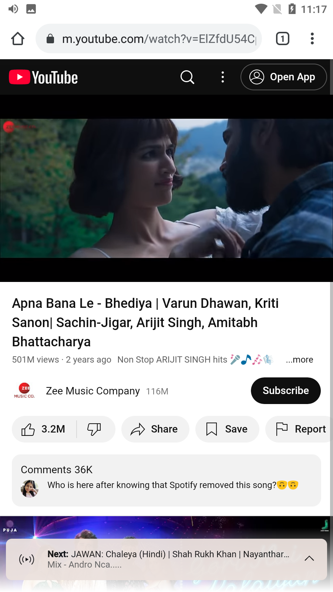

<div align="center">
  <h1>
    <br/>
    EasyVid - Social Media Video Downloader
  </h1>
  <h3>A Modern Video Downloader App for Multiple Social Media Platforms</h3>
</div>

<p align="center">
    
    
    
</p>

## 📸 Banner
<p align="center">
    
</p>

## 📌 Overview

EasyVid is a powerful video downloader application built with Flutter, designed to download videos from various social media platforms. The app features a beautiful UI with smooth animations and provides a complete solution for downloading and managing videos from multiple sources.

## 🚀 Tech Stack

- **Flutter** (UI Framework)
- **Firebase** (Analytics & Backend)
- **Hive** (Local Storage)
- **Video Player** (Video Playback)
- **Flutter Downloader** (Download Management)
- **Material Design 3**
- **Custom Animations**

## 🔑 Key Features

- ✅ **Multiple Platform Support**: Download from YouTube, Instagram, Facebook, Twitter, LinkedIn, and TikTok
- ✅ **Smart Storage Management**: Automatic storage permission handling
- ✅ **Background Downloads**: Download videos while using other apps
- ✅ **Progress Tracking**: Real-time download progress and speed
- ✅ **Video Player**: Built-in video player for downloaded content
- ✅ **File Management**: Organize and manage downloaded videos
- ✅ **Share Functionality**: Share videos with other apps
- ✅ **Storage Options**: Choose between external or app storage
- ✅ **Beautiful UI**: Modern and intuitive interface
- ✅ **Offline Access**: Access downloaded videos without internet

## 📸 Screenshots

### Welcome & Onboarding

<table border="1">
  <tr>
    <td align="center">
      
      <p><b>Splash Screen</b></p>
    </td>
    <td align="center">
      
      <p><b>Walkthrough 1</b></p>
    </td>
    <td align="center">
      
      <p><b>Walkthrough 2</b></p>
    </td>
  </tr>
  <tr>
    <td align="center">
      
      <p><b>Walkthrough 3</b></p>
    </td>
    <td align="center">
      
      <p><b>Home Page</b></p>
    </td>
    <td align="center">
      
      <p><b>Storage Permission</b></p>
    </td>
  </tr>
</table>

### Download Features

<table border="1">
  <tr>
    <td align="center">
      
      <p><b>YouTube Downloader</b></p>
    </td>
    <td align="center">
      
      <p><b>Instagram Downloader</b></p>
    </td>
    <td align="center">
      
      <p><b>Facebook Downloader</b></p>
    </td>
  </tr>
  <tr>
    <td align="center">
      
      <p><b>Twitter Downloader</b></p>
    </td>
    <td align="center">
      
      <p><b>LinkedIn Downloader</b></p>
    </td>
    <td align="center">
      
      <p><b>TikTok Downloader</b></p>
    </td>
  </tr>
</table>

### Download Process

<table border="1">
  <tr>
    <td align="center">
      
      <p><b>Fetch Video Details</b></p>
    </td>
    <td align="center">
      
      <p><b>Select Video Quality</b></p>
    </td>
    <td align="center">
      
      <p><b>Download Progress</b></p>
    </td>
  </tr>
  <tr>
    <td align="center">
      
      <p><b>Download Progress 1</b></p>
    </td>
    <td align="center">
      
      <p><b>Download Progress 2</b></p>
    </td>
    <td align="center">
      
      <p><b>Download Progress 3</b></p>
    </td>
  </tr>
  <tr>
    <td align="center">
      
      <p><b>Download Progress 4</b></p>
    </td>
    <td align="center">
      
      <p><b>Download Progress 5</b></p>
    </td>
    <td align="center">
      
      <p><b>Download Progress 6</b></p>
    </td>
  </tr>
  <tr>
    <td align="center">
      
      <p><b>Download Progress 7</b></p>
    </td>
    <td align="center">
      
      <p><b>Download Progress 8</b></p>
    </td>
    <td align="center">
      
      <p><b>Download Progress 9</b></p>
    </td>
  </tr>
</table>

### Video Playback

<table border="1">
  <tr>
    <td align="center">
      
      <p><b>Video Player 1</b></p>
    </td>
    <td align="center">
      
      <p><b>Video Player 2</b></p>
    </td>
    <td align="center">
      
      <p><b>Video Player 3</b></p>
    </td>
  </tr>
  <tr>
    <td align="center">
      
      <p><b>Video Player 4</b></p>
    </td>
    <td align="center">
      
      <p><b>Video Player 5</b></p>
    </td>
    <td align="center">
      
      <p><b>Video Player 6</b></p>
    </td>
  </tr>
</table>

### Downloads Management

<table border="1">
  <tr>
    <td align="center">
      
      <p><b>All Downloads</b></p>
    </td>
    <td align="center">
      
      <p><b>Quick Downloader</b></p>
    </td>
  </tr>
</table>

## 📱 Download APK

Download the latest version:
[APK/app-release.apk](APK/app-release.apk)

## Project Structure

```
lib/
├── src/
│   ├── features/
│   │   ├── home/
│   │   │   ├── pages/
│   │   │   │   ├── downloader.dart
│   │   │   │   └── home_page.dart
│   │   │   └── widgets/
│   │   ├── downloads/
│   │   │   ├── pages/
│   │   │   │   ├── downloads_page.dart
│   │   │   │   └── video_player_page.dart
│   │   │   └── widgets/
│   │   └── splash/
│   │       └── pages/
│   │           └── splash_screen.dart
│   └── core/
│       ├── constants/
│       ├── services/
│       └── utils/
└── main.dart
```

## 🎯 Features Coming Soon

- More social media platform support
- Video format conversion
- Batch downloads
- Download scheduling
- Cloud storage integration
- Video editing capabilities
- Multi-language support

## 🔧 Settings & Customization

- Download quality preferences
- Storage location selection
- Theme customization
- Download history management
- Notification settings
- Cache management

## 📖 How to Use

1. **Download Videos**
   - Select a social media platform
   - Paste video URL
   - Choose video quality
   - Start download

2. **Manage Downloads**
   - View all downloaded videos
   - Play videos in built-in player
   - Share videos with others
   - Delete unwanted videos

3. **Storage Options**
   - Choose between external storage
   - Use app storage as fallback
   - Manage storage permissions
   - Monitor storage usage

4. **Video Playback**
   - Play downloaded videos
   - Control playback
   - Adjust video quality
   - Share while playing

## 📝 License

This project is licensed under the MIT License - see the LICENSE file for details.
